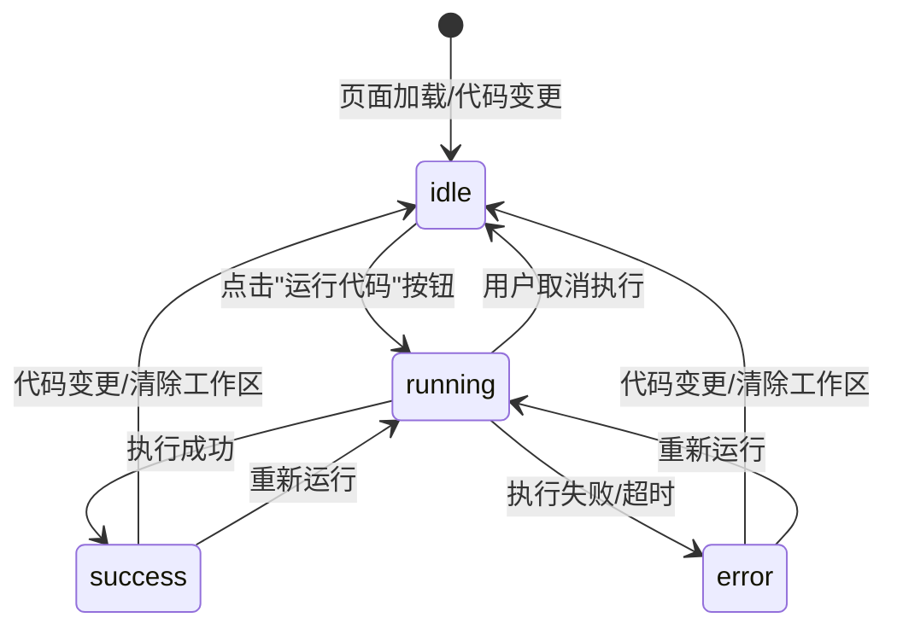

# 学生端实验室运行状态机

## 概述

本文档描述了学生端实验室页面的运行状态机设计，包括状态转换、UI交互和WebSocket通信机制。

## 状态机设计

### 状态定义

```typescript
type RunStatus = 'idle' | 'running' | 'success' | 'error';
```

### 状态转换图



### 状态详细说明

#### 1. idle（空闲状态）

**触发条件**:

- 页面初始加载
- 代码生成完成
- 工作区被清除
- 执行完成后代码发生变更

**UI表现**:

- 运行按钮：**启用**，显示"运行代码"
- 状态标签：显示"Ready"，蓝色
- 进度条：隐藏
- 输出面板：显示提示信息或上次执行结果
- 奖励弹层：隐藏

**允许操作**:

- 拖拽积木块
- 点击"运行代码"按钮
- 清除工作区

#### 2. running（运行状态）

**触发条件**:

- 用户点击"运行代码"按钮
- 代码提交到执行器

**UI表现**:

- 运行按钮：**禁用**，显示"运行中..."
- 状态标签：显示"Running…"，橙色
- 进度条：显示，无限循环动画
- 输出面板：显示"提交代码到执行器..."
- 奖励弹层：隐藏

**允许操作**:

- 无（所有操作被禁用）

**WebSocket连接**:

- 建立WebSocket连接到 `ws://executor:4070/run-results/{jobId}`
- 监听执行结果消息

#### 3. success（成功状态）

**触发条件**:

- 代码执行成功
- 收到WebSocket成功消息
- HTTP响应返回成功结果

**UI表现**:

- 运行按钮：**启用**，显示"运行代码"
- 状态标签：显示"Completed"，绿色
- 进度条：隐藏
- 输出面板：显示执行输出
- 奖励弹层：**显示**，展示奖励信息

**奖励弹层内容**:

```typescript
{
  message: "🎉 Great job! +20 XP (placeholder reward animation)",
  xp: 20,
  achievements: ["First Success", "Code Runner"]
}
```

**允许操作**:

- 重新运行代码
- 修改代码（会回到idle状态）
- 清除工作区

#### 4. error（错误状态）

**触发条件**:

- 代码执行失败
- 执行超时
- 静态分析失败
- WebSocket连接错误
- 网络请求失败

**UI表现**:

- 运行按钮：**启用**，显示"运行代码"
- 状态标签：显示"Error"，红色
- 进度条：隐藏
- 输出面板：显示错误信息
- 奖励弹层：隐藏

**错误信息类型**:

- 语法错误：显示Python语法错误
- 运行时错误：显示异常堆栈
- 超时错误：显示"⏱️ Timed out after X ms"
- 网络错误：显示连接失败信息
- 安全错误：显示"代码安全检查失败"

**允许操作**:

- 重新运行代码
- 修改代码（会回到idle状态）
- 清除工作区

---

## UI组件状态映射

### 运行按钮 (Run Button)

| 状态    | 文本        | 启用状态 | 样式               |
| ------- | ----------- | -------- | ------------------ |
| idle    | "运行代码"  | ✅ 启用  | primary            |
| running | "运行中..." | ❌ 禁用  | primary (disabled) |
| success | "运行代码"  | ✅ 启用  | primary            |
| error   | "运行代码"  | ✅ 启用  | primary            |

### 状态标签 (Status Badge)

| 状态    | 文本        | 颜色   | 图标 |
| ------- | ----------- | ------ | ---- |
| idle    | "Ready"     | blue   | ⏸️   |
| running | "Running…"  | orange | ⏳   |
| success | "Completed" | green  | ✅   |
| error   | "Error"     | red    | ❌   |

### 进度条 (Progress Bar)

| 状态    | 显示 | 动画     |
| ------- | ---- | -------- |
| idle    | 隐藏 | -        |
| running | 显示 | 无限循环 |
| success | 隐藏 | -        |
| error   | 隐藏 | -        |

### 输出面板 (Console Panel)

| 状态    | 内容                  | 样式     |
| ------- | --------------------- | -------- |
| idle    | 提示信息或上次结果    | 默认     |
| running | "提交代码到执行器..." | 加载中   |
| success | 执行输出              | 成功样式 |
| error   | 错误信息              | 错误样式 |

### 奖励弹层 (Reward Modal)

| 状态    | 显示     | 内容             |
| ------- | -------- | ---------------- |
| idle    | 隐藏     | -                |
| running | 隐藏     | -                |
| success | **显示** | XP奖励、成就徽章 |
| error   | 隐藏     | -                |

---

## WebSocket通信机制

### 连接建立

```typescript
const connectToWebSocket = (jobId: string) => {
  const url = `ws://executor:4070/run-results/${encodeURIComponent(jobId)}`;
  const socket = new WebSocket(url);

  socket.onopen = () => {
    console.log('WebSocket connected');
  };

  socket.onmessage = (event) => {
    const payload = JSON.parse(event.data);
    handleWebSocketMessage(payload);
  };

  socket.onerror = () => {
    setStatus('error');
    setConsoleText('WebSocket connection error');
  };

  socket.onclose = () => {
    console.log('WebSocket disconnected');
  };
};
```

### 消息处理

#### 执行结果消息

```typescript
if (payload?.type === 'run-result') {
  const result = payload.payload;
  if (result.timedOut) {
    setStatus('error');
    setConsoleText(`⏱️ Timed out after ${result.durationMs} ms`);
  } else if (result.stderr) {
    setStatus('error');
    setConsoleText(result.stderr);
  } else {
    setStatus('success');
    setConsoleText(result.stdout);
    setRewardMessage('🎉 Great job! +20 XP');
  }
}
```

#### 错误消息

```typescript
if (payload?.type === 'error') {
  setStatus('error');
  setConsoleText(`Error: ${payload.payload.message}`);
}
```

---

## 执行流程

### 1. 代码生成

```typescript
const handleWorkspaceChange = (workspace: Blockly.WorkspaceSvg) => {
  try {
    const pythonCode = generator.toPython(workspace);
    setPythonCode(pythonCode);
    setStatus('idle'); // 代码变更后回到idle状态
    setRewardMessage(null);
  } catch (error) {
    setStatus('error');
    setConsoleText(error.message);
  }
};
```

### 2. 执行请求

```typescript
const handleExecute = async () => {
  if (!workspace) {
    setStatus('error');
    setConsoleText('Please build blocks before running.');
    return;
  }

  setStatus('running');
  setConsoleText('Submitting code to executor…');

  try {
    const response = await fetch('/api/execute', {
      method: 'POST',
      headers: { 'Content-Type': 'application/json' },
      body: JSON.stringify({
        language: 'python',
        source: pythonCode,
        tests: [{ stdin: '' }],
      }),
    });

    const data = await response.json();
    handleExecutionResponse(data);
  } catch (error) {
    setStatus('error');
    setConsoleText(error.message);
  }
};
```

### 3. 响应处理

```typescript
const handleExecutionResponse = (data: ExecuteResponse) => {
  if (!data.ok) {
    setStatus('error');
    setConsoleText(data.error || 'Execution failed');
    return;
  }

  const result = data.results?.[0];
  if (result) {
    if (result.timedOut) {
      setStatus('error');
      setConsoleText(`⏱️ Timed out after ${result.durationMs} ms`);
    } else if (result.stderr) {
      setStatus('error');
      setConsoleText(result.stderr);
    } else {
      setStatus('success');
      setConsoleText(result.stdout);
      setRewardMessage('🎉 Great job! +20 XP');
    }
  }

  // 建立WebSocket连接
  if (data.jobId) {
    connectToWebSocket(data.jobId);
  }
};
```

---

## 错误处理策略

### 网络错误

- **连接失败**: 显示"网络连接失败，请检查网络"
- **超时**: 显示"请求超时，请重试"
- **服务器错误**: 显示"服务器错误，请稍后重试"

### 执行错误

- **语法错误**: 显示Python语法错误信息
- **运行时错误**: 显示异常堆栈和错误信息
- **超时错误**: 显示"代码执行超时"
- **内存超限**: 显示"内存使用超限"
- **安全检查失败**: 显示"代码包含不允许的操作"

### 用户友好提示

```typescript
const getErrorMessage = (error: any) => {
  if (error.message.includes('timeout')) {
    return '⏱️ 代码执行超时，请简化代码或减少循环次数';
  }
  if (error.message.includes('memory')) {
    return '💾 内存使用超限，请优化代码';
  }
  if (error.message.includes('blacklist')) {
    return '🚫 代码包含不允许的操作，请检查导入的模块';
  }
  return error.message || '执行失败，请重试';
};
```

---

## 性能优化

### 防抖处理

```typescript
const debouncedWorkspaceChange = useMemo(() => debounce(handleWorkspaceChange, 300), [generator]);
```

### 连接管理

```typescript
useEffect(() => {
  return () => {
    // 组件卸载时关闭WebSocket连接
    wsRef.current?.close();
  };
}, []);
```

### 状态缓存

```typescript
const [lastSuccessfulCode, setLastSuccessfulCode] = useState('');
const [lastSuccessfulOutput, setLastSuccessfulOutput] = useState('');
```

---

## 测试用例

### 状态转换测试

```typescript
describe('Lab State Machine', () => {
  test('should transition from idle to running on execute', () => {
    // 测试状态转换
  });

  test('should transition from running to success on completion', () => {
    // 测试成功状态
  });

  test('should transition from running to error on failure', () => {
    // 测试错误状态
  });
});
```

### WebSocket测试

```typescript
describe('WebSocket Communication', () => {
  test('should connect to WebSocket on job completion', () => {
    // 测试WebSocket连接
  });

  test('should handle run-result messages', () => {
    // 测试结果消息处理
  });

  test('should handle error messages', () => {
    // 测试错误消息处理
  });
});
```

---

**文档版本**: v1.0  
**最后更新**: 2024-01-03  
**维护人员**: 前端团队  
**审核状态**: 待审核
