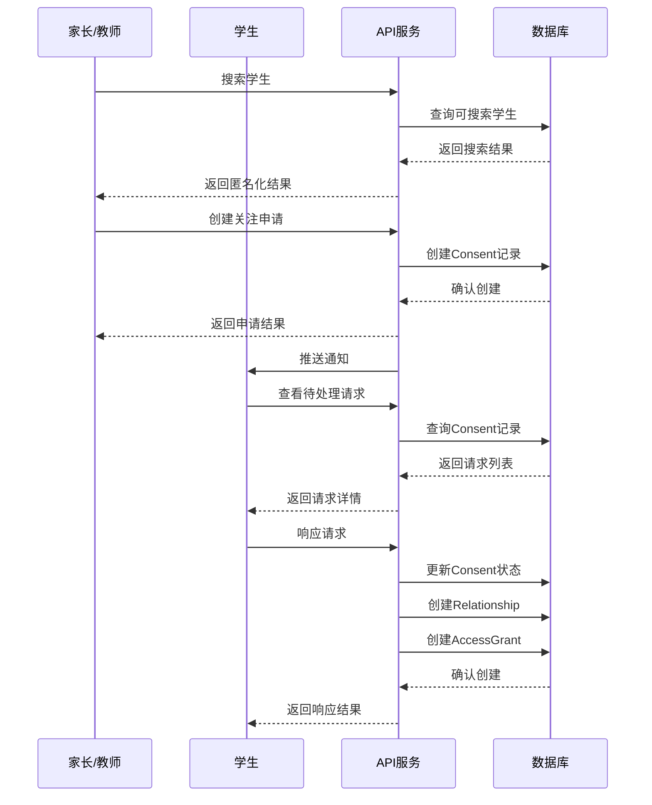
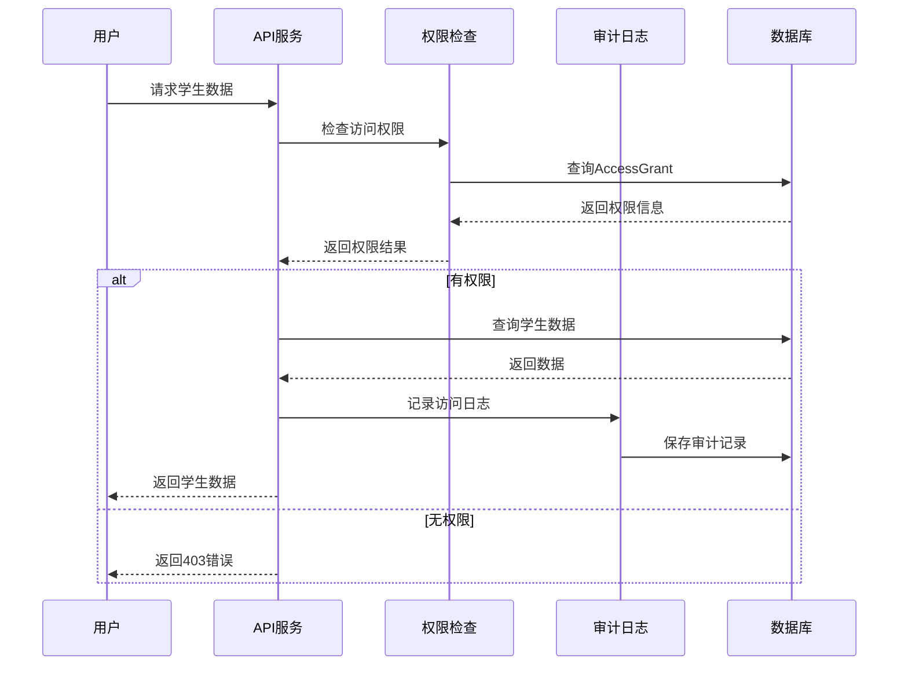

# 接口契约文档 (Interface Contracts)

## 概述

本文档定义了儿童编程平台的核心接口契约，包括数据模型、API 端点、权限控制和数据流转规范。

## 数据模型契约

### 用户模型 (User)

```typescript
interface User {
  id: string;                    // UUID
  email: string;                 // 唯一邮箱
  displayName?: string;          // 显示名称
  nickname?: string;             // 搜索昵称
  school?: string;               // 学校名称
  className?: string;            // 班级名称
  discoverable: boolean;         // 是否可被搜索，默认 false
  passwordHash?: string;         // 密码哈希
  roleId: number;                // 角色ID
  role: Role;                    // 角色信息
  createdAt: Date;               // 创建时间
  updatedAt: Date;               // 更新时间
}
```

### 班级模型 (Class)

```typescript
interface Class {
  id: string;                    // UUID
  name: string;                  // 班级名称
  description?: string;          // 班级描述
  ownerTeacherId: string;        // 教师ID
  ownerTeacher: User;            // 教师信息
  code: string;                  // 邀请码
  status: ClassStatus;           // 班级状态
  enrollments: ClassEnrollment[]; // 注册记录
  createdAt: Date;               // 创建时间
  updatedAt: Date;               // 更新时间
}

enum ClassStatus {
  ACTIVE = 'ACTIVE',             // 活跃
  INACTIVE = 'INACTIVE',         // 非活跃
  ARCHIVED = 'ARCHIVED'          // 已归档
}
```

### 班级注册模型 (ClassEnrollment)

```typescript
interface ClassEnrollment {
  id: string;                    // UUID
  classId: string;               // 班级ID
  studentId: string;             // 学生ID
  status: EnrollmentStatus;      // 注册状态
  class: Class;                  // 班级信息
  student: User;                 // 学生信息
  createdAt: Date;               // 创建时间
  updatedAt: Date;               // 更新时间
}

enum EnrollmentStatus {
  PENDING = 'PENDING',           // 待审核
  ACTIVE = 'ACTIVE',             // 已激活
  REVOKED = 'REVOKED'            // 已撤销
}
```

### 关系模型 (Relationship)

```typescript
interface Relationship {
  id: string;                    // UUID
  studentId: string;             // 学生ID
  partyId: string;               // 对方ID（家长/教师）
  partyRole: PartyRole;          // 对方角色
  source: RelationshipSource;    // 关系来源
  status: RelationshipStatus;    // 关系状态
  student: User;                 // 学生信息
  party: User;                   // 对方信息
  accessGrants: AccessGrant[];   // 访问授权
  createdAt: Date;               // 创建时间
  revokedAt?: Date;              // 撤销时间
  updatedAt: Date;               // 更新时间
}

enum PartyRole {
  PARENT = 'PARENT',             // 家长
  TEACHER = 'TEACHER'            // 教师
}

enum RelationshipSource {
  SHARE_CODE = 'SHARE_CODE',     // 分享码
  SEARCH = 'SEARCH',             // 搜索
  CLASS_INVITE = 'CLASS_INVITE'  // 班级邀请
}

enum RelationshipStatus {
  PENDING = 'PENDING',           // 待处理
  ACTIVE = 'ACTIVE',             // 已激活
  REVOKED = 'REVOKED',           // 已撤销
  EXPIRED = 'EXPIRED'            // 已过期
}
```

### 访问授权模型 (AccessGrant)

```typescript
interface AccessGrant {
  id: string;                    // UUID
  granteeId: string;             // 被授权者ID
  studentId: string;             // 学生ID
  scope: string[];               // 权限范围
  status: GrantStatus;           // 授权状态
  expiresAt?: Date;              // 过期时间
  relationshipId?: string;       // 关系ID
  relationship?: Relationship;   // 关系信息
  grantee: User;                 // 被授权者信息
  student: User;                 // 学生信息
  createdAt: Date;               // 创建时间
  updatedAt: Date;               // 更新时间
}

enum GrantStatus {
  ACTIVE = 'ACTIVE',             // 活跃
  INACTIVE = 'INACTIVE',         // 非活跃
  EXPIRED = 'EXPIRED',           // 已过期
  REVOKED = 'REVOKED'            // 已撤销
}

// 权限范围定义
type AccessScope = 
  | 'progress:read'              // 查看学习进度
  | 'works:read'                 // 查看作品
  | 'metrics:read'               // 查看指标数据
  | 'badges:read'                // 查看徽章
  | 'courses:read'               // 查看课程
  | 'profile:read'               // 查看基本信息
  | 'activity:read';             // 查看活动记录
```

### 同意书模型 (Consent)

```typescript
interface Consent {
  id: string;                    // UUID
  studentId: string;             // 学生ID
  requesterId: string;           // 申请者ID
  purpose: string;               // 申请目的
  scope: string[];               // 权限范围
  status: ConsentStatus;         // 同意状态
  expiresAt?: Date;              // 过期时间
  student: User;                 // 学生信息
  requester: User;               // 申请者信息
  createdAt: Date;               // 创建时间
  updatedAt: Date;               // 更新时间
}

enum ConsentStatus {
  PENDING = 'PENDING',           // 待处理
  APPROVED = 'APPROVED',         // 已同意
  REJECTED = 'REJECTED',         // 已拒绝
  EXPIRED = 'EXPIRED',           // 已过期
  REVOKED = 'REVOKED'            // 已撤销
}
```

### 审计日志模型 (AuditLog)

```typescript
interface AuditLog {
  id: string;                    // UUID
  actorId: string;               // 操作者ID
  action: string;                // 操作类型
  targetType: string;            // 目标类型
  targetId: string;              // 目标ID
  metadata?: Record<string, any>; // 元数据
  actor: User;                   // 操作者信息
  ts: Date;                      // 时间戳
}

// 操作类型定义
type AuditAction = 
  | 'view_student_data'          // 查看学生数据
  | 'grant_access'               // 授予访问权限
  | 'revoke_access'              // 撤销访问权限
  | 'create_relationship'        // 创建关系
  | 'update_relationship'        // 更新关系
  | 'delete_relationship'        // 删除关系
  | 'export_data'                // 导出数据
  | 'search_student'             // 搜索学生
  | 'join_class'                 // 加入班级
  | 'leave_class';               // 退出班级
```

### 指标快照模型 (MetricsSnapshot)

```typescript
interface MetricsSnapshot {
  id: string;                    // UUID
  studentId: string;             // 学生ID
  date: Date;                    // 日期
  chapterId?: string;            // 章节ID
  tasksDone: number;             // 完成任务数
  accuracy: number;              // 准确率 (0.0-1.0)
  timeSpentMin: number;          // 学习时长（分钟）
  streakDays: number;            // 连续学习天数
  xpGained: number;              // 获得经验值
  student: User;                 // 学生信息
  createdAt: Date;               // 创建时间
}
```

## API 接口契约

### 用户管理接口

#### 更新搜索设置
```typescript
PUT /students/search-settings
Body: {
  isSearchable: boolean;
  searchNickname?: string;
  school?: string;
  className?: string;
}
Response: User
```

#### 获取搜索设置
```typescript
GET /students/search-settings
Response: {
  isSearchable: boolean;
  searchNickname?: string;
  school?: string;
  className?: string;
  anonymousId?: string;
}
```

### 搜索接口

#### 搜索学生
```typescript
GET /students/search?nickname=string&school=string&className=string
Response: Array<{
  id: string;
  anonymousId: string;
  searchNickname: string;
  school?: string;
  className?: string;
}>
```

#### 创建关注申请
```typescript
POST /students/follow-request
Body: {
  studentAnonymousId: string;
  purpose: string;
  reason: string;
  expiresAt?: string;
}
Response: Consent
```

### 分享码接口

#### 生成分享码
```typescript
POST /students/share-code
Body: {
  purpose: string;
  expiresAt?: string;
}
Response: {
  shareCode: string;
  expiresAt?: Date;
  purpose: string;
  qrCodeUrl: string;
}
```

#### 通过分享码查找学生
```typescript
GET /students/share-code/:code
Response: {
  student: {
    id: string;
    displayName: string;
  };
  purpose: string;
  expiresAt?: Date;
}
```

### 关系管理接口

#### 获取待处理请求
```typescript
GET /relationships/pending-requests
Response: Array<Consent>
```

#### 响应关注请求
```typescript
POST /relationships/respond-to-request
Body: {
  consentId: string;
  status: 'APPROVED' | 'REJECTED';
  scopes?: string[];
  expiresAt?: string;
}
Response: Consent
```

#### 获取关系列表
```typescript
GET /relationships/my-relationships
Response: Array<Relationship>
```

### 班级管理接口

#### 创建班级
```typescript
POST /classes
Body: {
  name: string;
  description?: string;
}
Response: Class
```

#### 加入班级
```typescript
POST /classes/join
Body: {
  inviteCode: string;
}
Response: ClassEnrollment
```

#### 批准入班
```typescript
POST /classes/:id/approve
Body: {
  enrollmentId: string;
}
Response: ClassEnrollment
```

### 数据访问接口

#### 检查访问权限
```typescript
GET /relationships/check-access/:studentId?scope=string
Response: {
  hasAccess: boolean;
}
```

#### 获取学生数据
```typescript
GET /students/:id/data
Response: {
  id: string;
  displayName: string;
  progress: {
    xp: number;
    streakDays: number;
    completedCourses: number;
    totalCourses: number;
  };
  recentWorks: Array<Work>;
  courses: Array<Course>;
}
```

### 审计日志接口

#### 记录审计日志
```typescript
POST /audit/logs
Body: {
  action: string;
  targetType: string;
  targetId: string;
  metadata?: Record<string, any>;
}
Response: AuditLog
```

#### 查询审计日志
```typescript
GET /audit/logs?actorId=string&action=string&startDate=string&endDate=string
Response: Array<AuditLog>
```

## 权限控制契约

### 角色权限矩阵

| 操作 | STUDENT | PARENT | TEACHER | ADMIN |
|------|---------|--------|---------|-------|
| 查看自己数据 | ✅ | ✅ | ✅ | ✅ |
| 查看其他学生数据 | ❌ | ✅* | ✅* | ✅ |
| 搜索学生 | ❌ | ✅ | ✅ | ✅ |
| 创建关注申请 | ❌ | ✅ | ✅ | ❌ |
| 响应关注请求 | ✅ | ❌ | ❌ | ❌ |
| 管理班级 | ❌ | ❌ | ✅ | ✅ |
| 查看审计日志 | ❌ | ❌ | ❌ | ✅ |

*需要相应授权

### 数据访问权限

```typescript
interface DataAccessPermission {
  studentId: string;             // 学生ID
  granteeId: string;             // 被授权者ID
  scopes: AccessScope[];         // 权限范围
  expiresAt?: Date;              // 过期时间
  conditions?: {                 // 访问条件
    timeRange?: {                // 时间范围
      start: Date;
      end: Date;
    };
    dataTypes?: string[];        // 数据类型限制
  };
}
```

## 数据流转契约

### 关注申请流程



### 数据访问流程



## 错误处理契约

### 标准错误响应

```typescript
interface ErrorResponse {
  error: {
    code: string;                // 错误代码
    message: string;             // 错误消息
    details?: Record<string, any>; // 错误详情
    timestamp: Date;             // 时间戳
    requestId: string;           // 请求ID
  };
}
```

### 常见错误代码

| 错误代码 | HTTP状态 | 说明 |
|----------|----------|------|
| UNAUTHORIZED | 401 | 未授权访问 |
| FORBIDDEN | 403 | 权限不足 |
| NOT_FOUND | 404 | 资源不存在 |
| VALIDATION_ERROR | 400 | 参数验证失败 |
| RELATIONSHIP_EXISTS | 409 | 关系已存在 |
| CONSENT_EXPIRED | 410 | 同意书已过期 |
| RATE_LIMIT_EXCEEDED | 429 | 请求频率超限 |

## 版本控制契约

### API版本策略

- 使用URL路径版本控制：`/api/v1/`
- 向后兼容性保证：至少支持2个主要版本
- 废弃通知：提前6个月通知API废弃
- 版本迁移：提供详细的迁移指南

### 数据模型版本控制

- 使用数据库迁移管理模型变更
- 向后兼容的字段变更（添加可选字段）
- 破坏性变更需要新的迁移脚本
- 保留历史数据完整性

---

**文档版本**: v1.0  
**最后更新**: 2024-01-03  
**维护人员**: 开发团队
