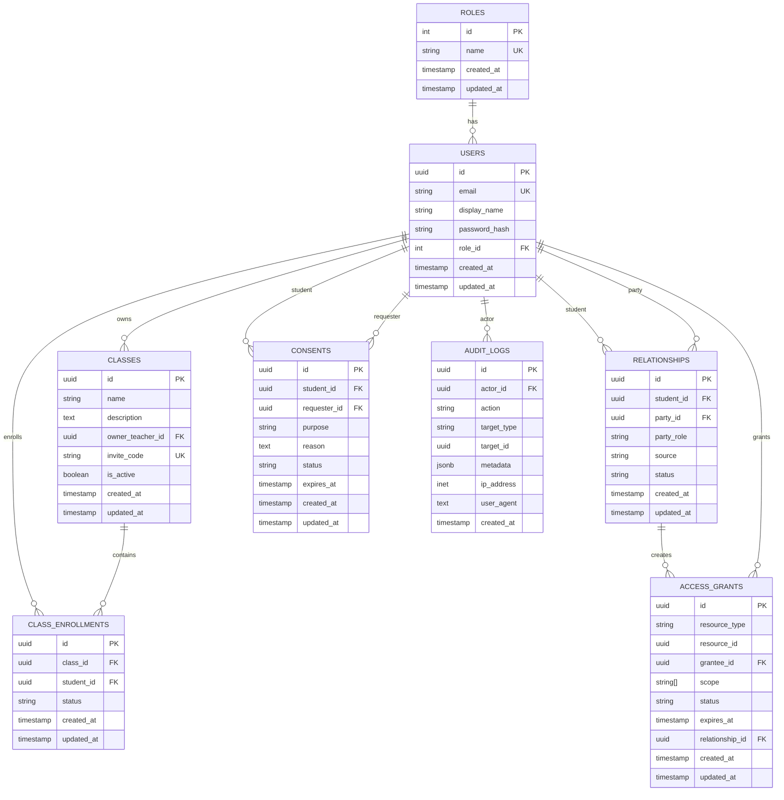

# 数据库设计文档

## 概述

本文档描述了儿童编程平台的数据库设计，包括数据模型、关系图、迁移脚本和索引策略。

## 数据模型

### 核心实体

#### 1. 用户管理 (User Management)

```sql
-- 角色表
CREATE TABLE roles (
    id SERIAL PRIMARY KEY,
    name VARCHAR(50) UNIQUE NOT NULL,
    created_at TIMESTAMP DEFAULT CURRENT_TIMESTAMP,
    updated_at TIMESTAMP DEFAULT CURRENT_TIMESTAMP
);

-- 用户表
CREATE TABLE users (
    id UUID PRIMARY KEY DEFAULT gen_random_uuid(),
    email VARCHAR(255) UNIQUE NOT NULL,
    display_name VARCHAR(100),
    password_hash VARCHAR(255),
    role_id INTEGER REFERENCES roles(id),
    created_at TIMESTAMP DEFAULT CURRENT_TIMESTAMP,
    updated_at TIMESTAMP DEFAULT CURRENT_TIMESTAMP
);
```

#### 2. 班级管理 (Class Management)

```sql
-- 班级表
CREATE TABLE classes (
    id UUID PRIMARY KEY DEFAULT gen_random_uuid(),
    name VARCHAR(100) NOT NULL,
    description TEXT,
    owner_teacher_id UUID REFERENCES users(id),
    invite_code VARCHAR(20) UNIQUE NOT NULL,
    is_active BOOLEAN DEFAULT true,
    created_at TIMESTAMP DEFAULT CURRENT_TIMESTAMP,
    updated_at TIMESTAMP DEFAULT CURRENT_TIMESTAMP
);

-- 班级注册表
CREATE TABLE class_enrollments (
    id UUID PRIMARY KEY DEFAULT gen_random_uuid(),
    class_id UUID REFERENCES classes(id) ON DELETE CASCADE,
    student_id UUID REFERENCES users(id) ON DELETE CASCADE,
    status VARCHAR(20) DEFAULT 'PENDING',
    created_at TIMESTAMP DEFAULT CURRENT_TIMESTAMP,
    updated_at TIMESTAMP DEFAULT CURRENT_TIMESTAMP,
    UNIQUE(class_id, student_id)
);
```

#### 3. 关系管理 (Relationship Management)

```sql
-- 关系表
CREATE TABLE relationships (
    id UUID PRIMARY KEY DEFAULT gen_random_uuid(),
    student_id UUID REFERENCES users(id) ON DELETE CASCADE,
    party_id UUID REFERENCES users(id) ON DELETE CASCADE,
    party_role VARCHAR(20) NOT NULL, -- PARENT, TEACHER
    source VARCHAR(20) NOT NULL, -- INVITE_CODE, CLASS_LINK, MANUAL
    status VARCHAR(20) DEFAULT 'ACTIVE',
    created_at TIMESTAMP DEFAULT CURRENT_TIMESTAMP,
    updated_at TIMESTAMP DEFAULT CURRENT_TIMESTAMP,
    UNIQUE(student_id, party_id)
);

-- 访问授权表
CREATE TABLE access_grants (
    id UUID PRIMARY KEY DEFAULT gen_random_uuid(),
    resource_type VARCHAR(50) NOT NULL, -- STUDENT_PROGRESS, STUDENT_WORKS, CLASS_PROGRESS
    resource_id UUID NOT NULL,
    grantee_id UUID REFERENCES users(id) ON DELETE CASCADE,
    scope TEXT[] NOT NULL, -- ['progress:read', 'works:read']
    status VARCHAR(20) DEFAULT 'ACTIVE',
    expires_at TIMESTAMP,
    relationship_id UUID REFERENCES relationships(id) ON DELETE CASCADE,
    created_at TIMESTAMP DEFAULT CURRENT_TIMESTAMP,
    updated_at TIMESTAMP DEFAULT CURRENT_TIMESTAMP
);

-- 同意书表
CREATE TABLE consents (
    id UUID PRIMARY KEY DEFAULT gen_random_uuid(),
    student_id UUID REFERENCES users(id) ON DELETE CASCADE,
    requester_id UUID REFERENCES users(id) ON DELETE CASCADE,
    purpose VARCHAR(100) NOT NULL,
    reason TEXT NOT NULL,
    status VARCHAR(20) DEFAULT 'PENDING',
    expires_at TIMESTAMP,
    created_at TIMESTAMP DEFAULT CURRENT_TIMESTAMP,
    updated_at TIMESTAMP DEFAULT CURRENT_TIMESTAMP
);
```

#### 4. 审计日志 (Audit Logging)

```sql
-- 审计日志表
CREATE TABLE audit_logs (
    id UUID PRIMARY KEY DEFAULT gen_random_uuid(),
    actor_id UUID REFERENCES users(id) ON DELETE CASCADE,
    action VARCHAR(100) NOT NULL,
    target_type VARCHAR(50) NOT NULL,
    target_id UUID NOT NULL,
    metadata JSONB,
    ip_address INET,
    user_agent TEXT,
    created_at TIMESTAMP DEFAULT CURRENT_TIMESTAMP
);
```

## 实体关系图 (ER Diagram)



## 索引策略

### 主要索引

```sql
-- 用户表索引
CREATE INDEX idx_users_email ON users(email);
CREATE INDEX idx_users_role_id ON users(role_id);
CREATE INDEX idx_users_created_at ON users(created_at);

-- 班级表索引
CREATE INDEX idx_classes_owner_teacher_id ON classes(owner_teacher_id);
CREATE INDEX idx_classes_invite_code ON classes(invite_code);
CREATE INDEX idx_classes_is_active ON classes(is_active);

-- 班级注册表索引
CREATE INDEX idx_class_enrollments_class_id ON class_enrollments(class_id);
CREATE INDEX idx_class_enrollments_student_id ON class_enrollments(student_id);
CREATE INDEX idx_class_enrollments_status ON class_enrollments(status);

-- 关系表索引
CREATE INDEX idx_relationships_student_id ON relationships(student_id);
CREATE INDEX idx_relationships_party_id ON relationships(party_id);
CREATE INDEX idx_relationships_status ON relationships(status);

-- 访问授权表索引
CREATE INDEX idx_access_grants_grantee_id ON access_grants(grantee_id);
CREATE INDEX idx_access_grants_resource_id ON access_grants(resource_id);
CREATE INDEX idx_access_grants_status ON access_grants(status);
CREATE INDEX idx_access_grants_expires_at ON access_grants(expires_at);

-- 同意书表索引
CREATE INDEX idx_consents_student_id ON consents(student_id);
CREATE INDEX idx_consents_requester_id ON consents(requester_id);
CREATE INDEX idx_consents_status ON consents(status);

-- 审计日志表索引
CREATE INDEX idx_audit_logs_actor_id ON audit_logs(actor_id);
CREATE INDEX idx_audit_logs_target_type ON audit_logs(target_type);
CREATE INDEX idx_audit_logs_target_id ON audit_logs(target_id);
CREATE INDEX idx_audit_logs_created_at ON audit_logs(created_at);
CREATE INDEX idx_audit_logs_action ON audit_logs(action);
```

### 复合索引

```sql
-- 复合索引优化查询性能
CREATE INDEX idx_access_grants_grantee_resource ON access_grants(grantee_id, resource_id);
CREATE INDEX idx_access_grants_status_expires ON access_grants(status, expires_at);
CREATE INDEX idx_audit_logs_actor_created ON audit_logs(actor_id, created_at);
CREATE INDEX idx_audit_logs_target_created ON audit_logs(target_type, target_id, created_at);
```

## 迁移脚本

### 初始化迁移

```sql
-- 001_init_database.sql
-- 创建基础表结构
-- 插入默认角色数据
-- 创建基础索引
```

### 功能迁移

```sql
-- 002_add_student_data_access_models.sql
-- 添加班级、关系、授权相关表
-- 创建相关索引
-- 添加外键约束
```

### 性能优化迁移

```sql
-- 003_optimize_performance.sql
-- 添加复合索引
-- 优化查询性能
-- 添加分区表（如需要）
```

## 数据安全

### 加密策略

1. **敏感数据加密**
   - 密码哈希：使用 Argon2 算法
   - 个人信息：AES-256 加密
   - 审计日志：不可篡改存储

2. **传输加密**
   - 数据库连接：TLS 1.3
   - 应用层：HTTPS
   - 内部通信：加密通道

### 备份策略

1. **备份频率**
   - 全量备份：每日
   - 增量备份：每小时
   - 事务日志：实时

2. **备份存储**
   - 本地存储：7天
   - 异地存储：30天
   - 长期归档：1年

### 监控告警

1. **性能监控**
   - 查询响应时间
   - 连接池使用率
   - 磁盘空间使用

2. **安全监控**
   - 异常访问模式
   - 权限变更记录
   - 数据泄露检测

## 数据治理

### 数据分类

1. **个人身份信息 (PII)**
   - 姓名、邮箱、头像
   - 需要特殊保护
   - 支持数据删除

2. **学习数据**
   - 进度、作品、成绩
   - 需要授权访问
   - 支持匿名化

3. **系统数据**
   - 日志、配置、统计
   - 内部使用
   - 定期清理

### 数据生命周期

1. **创建阶段**
   - 数据验证
   - 权限设置
   - 审计记录

2. **使用阶段**
   - 访问控制
   - 使用监控
   - 定期审查

3. **销毁阶段**
   - 安全删除
   - 备份清理
   - 审计确认

## 性能优化

### 查询优化

1. **索引优化**
   - 分析查询模式
   - 创建合适索引
   - 定期维护索引

2. **查询重写**
   - 避免全表扫描
   - 使用合适连接
   - 优化子查询

### 连接池管理

1. **连接配置**
   - 最大连接数：100
   - 最小连接数：10
   - 连接超时：30秒

2. **连接监控**
   - 活跃连接数
   - 等待连接数
   - 连接错误率

## 维护计划

### 日常维护

1. **每日任务**
   - 检查数据库状态
   - 监控性能指标
   - 备份验证

2. **每周任务**
   - 索引维护
   - 统计信息更新
   - 日志清理

### 定期维护

1. **每月任务**
   - 性能分析
   - 容量规划
   - 安全审查

2. **每季度任务**
   - 架构审查
   - 优化建议
   - 升级计划

---

**文档版本**: v1.0  
**最后更新**: 2024-01-02  
**维护人员**: 数据库团队
