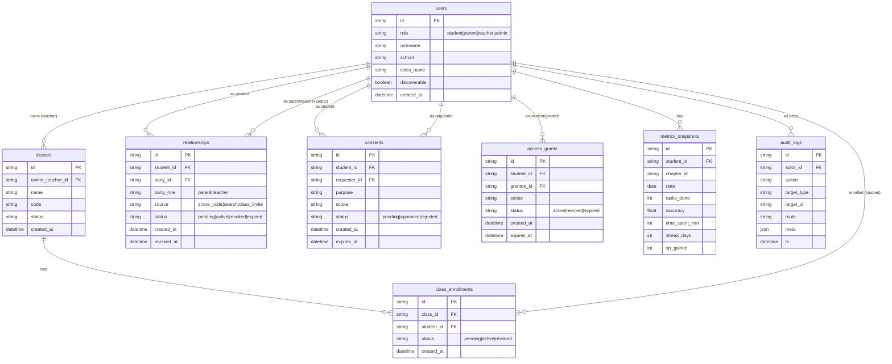

# 数据模型（ER）

## 实体与关系
- users：系统账户（student/parent/teacher/admin）
- classes：班级（teacher 拥有者）
- class_enrollments：学生入班（pending/active/revoked）
- relationships：学生与家长/老师关系（来源：share_code/search/class_invite）
- consents：同意记录（pending/approved/rejected）
- access_grants：授权令牌（scope、到期、状态）
- metrics_snapshots：指标快照（用于趋势/对比）
- audit_logs：审计日志（所有查看/导出）

## Mermaid ER
