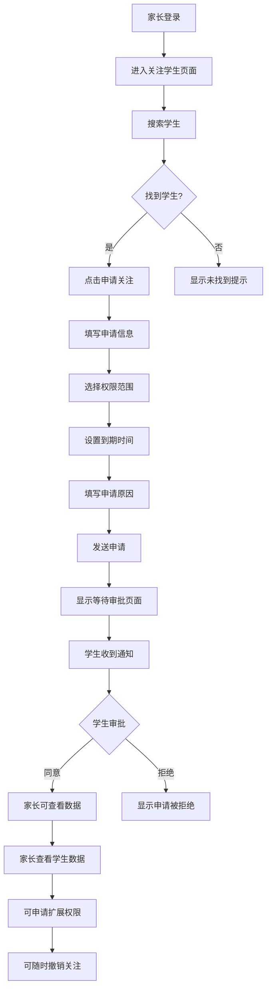
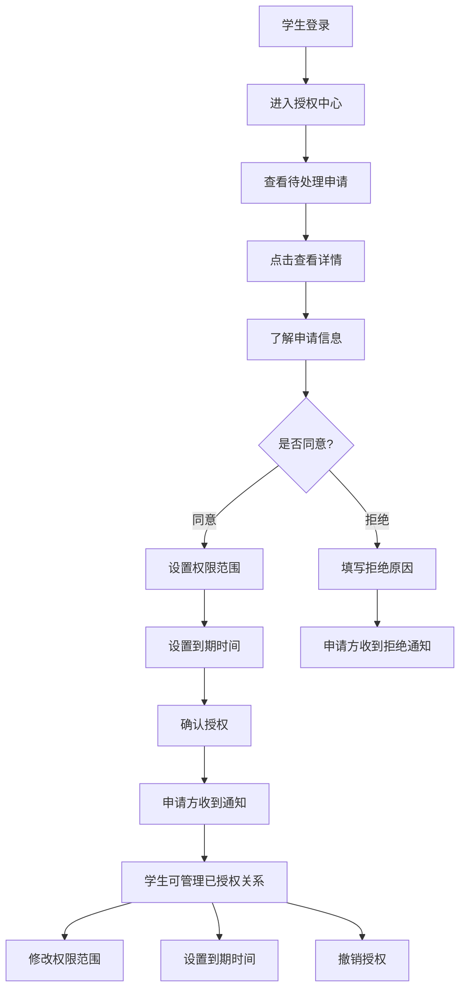
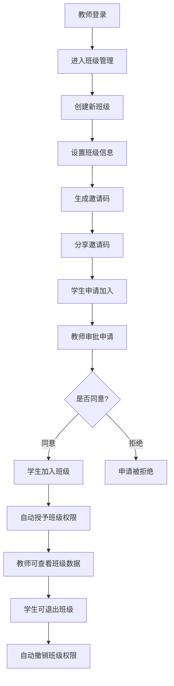

# 前端交互设计文档

## 概述

本文档详细描述了家长/老师查看学生数据功能的前端交互设计，包括学生端授权中心、家长端关注学生、教师端班级与对比等核心功能的用户界面和交互流程。

## 设计原则

### 1. 隐私优先

- 默认最小权限原则
- 清晰的权限范围说明
- 透明的数据使用告知

### 2. 用户友好

- 直观的操作流程
- 清晰的状态反馈
- 简洁的界面设计

### 3. 安全可控

- 明确的授权管理
- 便捷的权限撤销
- 完整的操作记录

---

## 一、学生端 · 授权中心

### 1.1 页面结构

#### 主导航

```
授权中心
├── 待处理 (pending)
├── 已授权 (active)
└── 已撤销 (revoked)
```

#### 页面布局

```
┌─────────────────────────────────────────────────────────┐
│ 授权中心                                    [设置] [帮助] │
├─────────────────────────────────────────────────────────┤
│ [待处理] [已授权] [已撤销]                              │
├─────────────────────────────────────────────────────────┤
│                                                         │
│  ┌─────────────────────────────────────────────────┐   │
│  │ 待处理申请 (3)                                   │   │
│  │                                                 │   │
│  │ ┌─────────────────────────────────────────────┐ │   │
│  │ │ 申请人: 张妈妈 (家长)                        │ │   │
│  │ │ 申请范围: 学习进度、完成情况                 │ │   │
│  │ │ 申请时间: 2024-01-03 14:30                  │ │   │
│  │ │ 到期日: 2024-04-03                          │ │   │
│  │ │                                             │ │   │
│  │ │ [查看详情] [同意] [拒绝]                     │ │   │
│  │ └─────────────────────────────────────────────┘ │   │
│  │                                                 │   │
│  │ ┌─────────────────────────────────────────────┐ │   │
│  │ │ 申请人: 李老师 (教师)                        │ │   │
│  │ │ 申请范围: 课堂表现、作业完成                 │ │   │
│  │ │ 申请时间: 2024-01-02 09:15                  │ │   │
│  │ │ 到期日: 2024-07-02                          │ │   │
│  │ │                                             │ │   │
│  │ │ [查看详情] [同意] [拒绝]                     │ │   │
│  │ └─────────────────────────────────────────────┘ │   │
│  └─────────────────────────────────────────────────┘   │
│                                                         │
└─────────────────────────────────────────────────────────┘
```

### 1.2 交互设计

#### 1.2.1 待处理申请卡片

```typescript
interface PendingRequestCard {
  id: string;
  applicantName: string;
  applicantRole: 'parent' | 'teacher';
  requestScope: string[];
  requestTime: string;
  expiresAt: string;
  status: 'pending';
  actions: {
    viewDetails: () => void;
    approve: () => void;
    reject: () => void;
  };
}
```

#### 1.2.2 查看详情模态框

```
┌─────────────────────────────────────────────────────────┐
│ 申请详情                                    [×]         │
├─────────────────────────────────────────────────────────┤
│ 申请人信息:                                             │
│ • 姓名: 张妈妈                                          │
│ • 身份: 家长                                            │
│ • 关系: 监护人                                          │
│                                                         │
│ 申请内容:                                               │
│ • 查看范围: 学习进度、完成情况、成绩统计                │
│ • 申请原因: 了解孩子学习情况，提供家庭辅导              │
│ • 到期时间: 2024-04-03                                 │
│                                                         │
│ 权限说明:                                               │
│ • 只能查看已授权的数据范围                              │
│ • 不能修改任何学习内容                                  │
│ • 可以随时撤销授权                                      │
│                                                         │
│ [拒绝申请]                    [同意申请]                │
└─────────────────────────────────────────────────────────┘
```

#### 1.2.3 已授权关系卡片

```typescript
interface ActiveRelationshipCard {
  id: string;
  partyName: string;
  partyRole: 'parent' | 'teacher';
  grantedScope: string[];
  grantedAt: string;
  expiresAt: string;
  status: 'active';
  actions: {
    viewDetails: () => void;
    modifyScope: () => void;
    setExpiry: () => void;
    revoke: () => void;
  };
}
```

#### 1.2.4 修改权限范围模态框

```
┌─────────────────────────────────────────────────────────┐
│ 修改权限范围                                [×]         │
├─────────────────────────────────────────────────────────┤
│ 当前权限范围:                                           │
│ ☑ 学习进度 (进度条、完成章节)                          │
│ ☑ 完成情况 (任务完成数、准确率)                        │
│ ☐ 代码内容 (具体代码实现)                              │
│ ☐ 学习时长 (详细时间记录)                              │
│                                                         │
│ 到期时间:                                               │
│ [2024-04-03] [永久] [自定义]                           │
│                                                         │
│ 修改说明:                                               │
│ [可选填写修改原因]                                      │
│                                                         │
│ [取消]                    [保存修改]                    │
└─────────────────────────────────────────────────────────┘
```

### 1.3 状态管理

#### 1.3.1 申请状态流转

```
pending → approved → active
       ↘ rejected → revoked
```

#### 1.3.2 权限范围枚举

```typescript
enum PermissionScope {
  PROGRESS = 'progress', // 学习进度
  COMPLETION = 'completion', // 完成情况
  CODE_CONTENT = 'code_content', // 代码内容
  TIME_RECORDS = 'time_records', // 学习时长
  ACHIEVEMENTS = 'achievements', // 成就徽章
  ASSIGNMENTS = 'assignments', // 作业任务
}
```

---

## 二、家长端 · 关注学生

### 2.1 搜索学生页面

#### 2.1.1 页面布局

```
┌─────────────────────────────────────────────────────────┐
│ 关注学生                                    [返回]       │
├─────────────────────────────────────────────────────────┤
│                                                         │
│  ┌─────────────────────────────────────────────────┐   │
│  │ 搜索学生                                        │   │
│  │                                                 │   │
│  │ 搜索方式:                                       │   │
│  │ ○ 昵称 + 学校                                   │   │
│  │ ○ 匿名ID                                        │   │
│  │                                                 │   │
│  │ 昵称: [小明________________]                     │   │
│  │ 学校: [北京市第一中学________]                   │   │
│  │                                                 │   │
│  │ 或                                               │   │
│  │                                                 │   │
│  │ 匿名ID: [S-8F3K2Q____________]                   │   │
│  │                                                 │   │
│  │ [搜索]                                          │   │
│  └─────────────────────────────────────────────────┘   │
│                                                         │
│  搜索结果:                                             │
│  ┌─────────────────────────────────────────────────┐   │
│  │ 找到 1 个匹配的学生                              │   │
│  │                                                 │   │
│  │ ┌─────────────────────────────────────────────┐ │   │
│  │ │ 昵称: 小明                                  │ │   │
│  │ │ 学校: 北京市第一中学                        │ │   │
│  │ │ 班级: 初一(3)班                             │ │   │
│  │ │ 匿名ID: S-8F3K2Q                           │ │   │
│  │ │                                             │ │   │
│  │ │ [申请关注]                                  │ │   │
│  │ └─────────────────────────────────────────────┘ │   │
│  └─────────────────────────────────────────────────┘   │
│                                                         │
└─────────────────────────────────────────────────────────┘
```

#### 2.1.2 申请关注模态框

```
┌─────────────────────────────────────────────────────────┐
│ 申请关注学生                                [×]         │
├─────────────────────────────────────────────────────────┤
│ 学生信息:                                               │
│ • 昵称: 小明                                            │
│ • 学校: 北京市第一中学                                  │
│ • 班级: 初一(3)班                                       │
│                                                         │
│ 申请范围:                                               │
│ ☑ 学习进度 (进度条、完成章节)                          │
│ ☑ 完成情况 (任务完成数、准确率)                        │
│ ☐ 代码内容 (具体代码实现)                              │
│ ☐ 学习时长 (详细时间记录)                              │
│                                                         │
│ 申请原因:                                               │
│ [了解孩子学习情况，提供家庭辅导支持]                    │
│                                                         │
│ 到期时间:                                               │
│ [2024-04-03] [永久] [自定义]                           │
│                                                         │
│ [取消]                    [发送申请]                    │
└─────────────────────────────────────────────────────────┘
```

### 2.2 审批等待页面

#### 2.2.1 页面布局

```
┌─────────────────────────────────────────────────────────┐
│ 关注申请状态                                [返回]       │
├─────────────────────────────────────────────────────────┤
│                                                         │
│  ┌─────────────────────────────────────────────────┐   │
│  │ 申请状态                                        │   │
│  │                                                 │   │
│  │ 学生: 小明                                      │   │
│  │ 学校: 北京市第一中学                            │   │
│  │ 申请时间: 2024-01-03 14:30                      │   │
│  │                                                 │   │
│  │ 状态: 等待审批 ⏳                               │   │
│  │                                                 │   │
│  │ 申请范围:                                       │   │
│  │ • 学习进度                                      │   │
│  │ • 完成情况                                      │   │
│  │                                                 │   │
│  │ 到期时间: 2024-04-03                            │   │
│  │                                                 │   │
│  │ [撤回申请]                                      │   │
│  └─────────────────────────────────────────────────┘   │
│                                                         │
│  提示: 申请已发送，等待学生审批。学生会在24小时内处理。 │
│                                                         │
└─────────────────────────────────────────────────────────┘
```

### 2.3 学生数据页面

#### 2.3.1 页面布局

```
┌─────────────────────────────────────────────────────────┐
│ 小明的学习数据                              [返回]       │
├─────────────────────────────────────────────────────────┤
│                                                         │
│  ┌─────────────────────────────────────────────────┐   │
│  │ 授权信息                                        │   │
│  │ 范围: 学习进度、完成情况                        │   │
│  │ 到期: 2024-04-03                    [申请扩展]  │   │
│  └─────────────────────────────────────────────────┘   │
│                                                         │
│  ┌─────────────────────────────────────────────────┐   │
│  │ 学习概览                                        │   │
│  │                                                 │   │
│  │ [总时长: 1200分钟] [完成任务: 45个]             │   │
│  │ [准确率: 85%] [连续学习: 7天]                   │   │
│  └─────────────────────────────────────────────────┘   │
│                                                         │
│  ┌─────────────────────────────────────────────────┐   │
│  │ 学习趋势                    [授权范围] [到期日]  │   │
│  │                                                 │   │
│  │ [趋势图表区域]                                  │   │
│  └─────────────────────────────────────────────────┘   │
│                                                         │
│  ┌─────────────────────────────────────────────────┐   │
│  │ 班级对比                    [授权范围] [到期日]  │   │
│  │                                                 │   │
│  │ [对比图表区域]                                  │   │
│  └─────────────────────────────────────────────────┘   │
│                                                         │
└─────────────────────────────────────────────────────────┘
```

#### 2.3.2 申请扩展范围模态框

```
┌─────────────────────────────────────────────────────────┐
│ 申请扩展权限范围                            [×]         │
├─────────────────────────────────────────────────────────┤
│ 当前权限:                                               │
│ ☑ 学习进度 (进度条、完成章节)                          │
│ ☑ 完成情况 (任务完成数、准确率)                        │
│                                                         │
│ 申请新增:                                               │
│ ☐ 代码内容 (具体代码实现)                              │
│ ☐ 学习时长 (详细时间记录)                              │
│ ☐ 成就徽章 (获得的徽章和奖励)                          │
│                                                         │
│ 申请原因:                                               │
│ [希望了解更详细的学习情况，提供更好的辅导支持]          │
│                                                         │
│ 到期时间:                                               │
│ [2024-04-03] [永久] [自定义]                           │
│                                                         │
│ [取消]                    [发送申请]                    │
└─────────────────────────────────────────────────────────┘
```

---

## 三、教师端 · 班级与对比

### 3.1 班级管理页面

#### 3.1.1 页面布局

```
┌─────────────────────────────────────────────────────────┐
│ 班级管理                                    [返回]       │
├─────────────────────────────────────────────────────────┤
│                                                         │
│  ┌─────────────────────────────────────────────────┐   │
│  │ 我的班级                                        │   │
│  │                                                 │   │
│  │ ┌─────────────────────────────────────────────┐ │   │
│  │ │ 初一(3)班                                   │ │   │
│  │ │ 学生数: 25人                                │ │   │
│  │ │ 创建时间: 2024-01-01                        │ │   │
│  │ │ 邀请码: ABC123                              │ │   │
│  │ │                                             │ │   │
│  │ │ [复制邀请码] [管理班级] [查看详情]           │ │   │
│  │ └─────────────────────────────────────────────┘ │   │
│  │                                                 │   │
│  │ [创建新班级]                                    │   │
│  └─────────────────────────────────────────────────┘   │
│                                                         │
│  ┌─────────────────────────────────────────────────┐   │
│  │ 待审批申请 (3)                                  │   │
│  │                                                 │   │
│  │ ┌─────────────────────────────────────────────┐ │   │
│  │ │ 学生: 小红                                  │ │   │
│  │ │ 申请时间: 2024-01-03 10:30                  │ │   │
│  │ │ 申请原因: 希望加入班级学习                   │ │   │
│  │ │                                             │ │   │
│  │ │ [同意] [拒绝]                               │ │   │
│  │ └─────────────────────────────────────────────┘ │   │
│  └─────────────────────────────────────────────────┘   │
│                                                         │
└─────────────────────────────────────────────────────────┘
```

#### 3.1.2 创建班级模态框

```
┌─────────────────────────────────────────────────────────┐
│ 创建新班级                                [×]           │
├─────────────────────────────────────────────────────────┤
│ 班级信息:                                               │
│                                                         │
│ 班级名称: [初一(4)班________________]                   │
│ 班级描述: [新学期的编程入门班级]                        │
│                                                         │
│ 权限设置:                                               │
│ ☑ 学习进度 (进度条、完成章节)                          │
│ ☑ 完成情况 (任务完成数、准确率)                        │
│ ☐ 代码内容 (具体代码实现)                              │
│ ☐ 学习时长 (详细时间记录)                              │
│                                                         │
│ 邀请码设置:                                             │
│ ○ 自动生成 (推荐)                                      │
│ ○ 自定义: [ABC456_____]                                │
│                                                         │
│ [取消]                    [创建班级]                    │
└─────────────────────────────────────────────────────────┘
```

### 3.2 教学仪表盘

#### 3.2.1 页面布局

```
┌─────────────────────────────────────────────────────────┐
│ 教学仪表盘                                [返回]         │
├─────────────────────────────────────────────────────────┤
│                                                         │
│  ┌─────────────────────────────────────────────────┐   │
│  │ 班级概览                                        │   │
│  │                                                 │   │
│  │ [总学生: 25人] [活跃学生: 23人]                 │   │
│  │ [平均准确率: 78%] [总学习时长: 24000分钟]       │   │
│  └─────────────────────────────────────────────────┘   │
│                                                         │
│  ┌─────────────────────────────────────────────────┐   │
│  │ 关卡完成度热力图                                │   │
│  │                                                 │   │
│  │ [热力图区域]                                    │   │
│  └─────────────────────────────────────────────────┘   │
│                                                         │
│  ┌─────────────────────────────────────────────────┐   │
│  │ 准确率分布                                      │   │
│  │                                                 │   │
│  │ [柱状图区域]                                    │   │
│  └─────────────────────────────────────────────────┘   │
│                                                         │
│  ┌─────────────────────────────────────────────────┐   │
│  │ 最近活跃                                        │   │
│  │                                                 │   │
│  │ [活跃度图表区域]                                │   │
│  └─────────────────────────────────────────────────┘   │
│                                                         │
└─────────────────────────────────────────────────────────┘
```

### 3.3 学生对比页面

#### 3.3.1 页面布局

```
┌─────────────────────────────────────────────────────────┐
│ 学生对比                                    [返回]       │
├─────────────────────────────────────────────────────────┤
│                                                         │
│  ┌─────────────────────────────────────────────────┐   │
│  │ 选择学生                                        │   │
│  │                                                 │   │
│  │ 已选择: 3人                                     │   │
│  │                                                 │   │
│  │ ┌─────────────────────────────────────────────┐ │   │
│  │ │ 学生列表                                    │ │   │
│  │ │                                             │ │   │
│  │ │ ☑ 小明 (准确率: 85%)                        │ │   │
│  │ │ ☑ 小红 (准确率: 78%)                        │ │   │
│  │ │ ☑ 小刚 (准确率: 82%)                        │ │   │
│  │ │ ☐ 小丽 (准确率: 75%)                        │ │   │
│  │ │ ☐ 小强 (准确率: 80%)                        │ │   │
│  │ │                                             │ │   │
│  │ │ [全选] [清空]                               │ │   │
│  │ └─────────────────────────────────────────────┘ │   │
│  │                                                 │   │
│  │ 对比指标:                                       │   │
│  │ ☑ 准确率 ☑ 完成任务数 ☑ 学习时长               │   │
│  │ ☐ 经验值 ☐ 连续天数                            │   │
│  │                                                 │   │
│  │ 时间范围: [最近14天] [最近30天] [自定义]        │   │
│  │                                                 │   │
│  │ [开始对比]                                      │   │
│  └─────────────────────────────────────────────────┘   │
│                                                         │
│  ┌─────────────────────────────────────────────────┐   │
│  │ 对比结果                                        │   │
│  │                                                 │   │
│  │ [对比图表区域]                                  │   │
│  └─────────────────────────────────────────────────┘   │
│                                                         │
│  ┌─────────────────────────────────────────────────┐   │
│  │ 详细数据                                        │   │
│  │                                                 │   │
│  │ [数据表格区域]                                  │   │
│  └─────────────────────────────────────────────────┘   │
│                                                         │
└─────────────────────────────────────────────────────────┘
```

---

## 四、通用组件设计

### 4.1 权限范围选择器

```typescript
interface PermissionScopeSelector {
  scopes: PermissionScope[];
  selected: PermissionScope[];
  onChange: (scopes: PermissionScope[]) => void;
  disabled?: boolean;
  showDescription?: boolean;
}

const PermissionScopeSelector: React.FC<PermissionScopeSelector> = ({
  scopes,
  selected,
  onChange,
  disabled = false,
  showDescription = true,
}) => {
  return (
    <div className="permission-scope-selector">
      {scopes.map((scope) => (
        <div key={scope} className="scope-item">
          <Checkbox
            checked={selected.includes(scope)}
            onChange={(e) => {
              if (e.target.checked) {
                onChange([...selected, scope]);
              } else {
                onChange(selected.filter(s => s !== scope));
              }
            }}
            disabled={disabled}
          />
          <div className="scope-info">
            <div className="scope-name">{getScopeName(scope)}</div>
            {showDescription && (
              <div className="scope-description">{getScopeDescription(scope)}</div>
            )}
          </div>
        </div>
      ))}
    </div>
  );
};
```

### 4.2 到期时间选择器

```typescript
interface ExpiryTimeSelector {
  value: string | null;
  onChange: (value: string | null) => void;
  disabled?: boolean;
}

const ExpiryTimeSelector: React.FC<ExpiryTimeSelector> = ({
  value,
  onChange,
  disabled = false,
}) => {
  const [mode, setMode] = useState<'permanent' | 'custom'>('permanent');

  return (
    <div className="expiry-time-selector">
      <Radio.Group
        value={mode}
        onChange={(e) => {
          setMode(e.target.value);
          if (e.target.value === 'permanent') {
            onChange(null);
          }
        }}
        disabled={disabled}
      >
        <Radio value="permanent">永久</Radio>
        <Radio value="custom">自定义</Radio>
      </Radio.Group>

      {mode === 'custom' && (
        <DatePicker
          value={value ? dayjs(value) : null}
          onChange={(date) => onChange(date?.format('YYYY-MM-DD') || null)}
          disabled={disabled}
          style={{ marginTop: 8 }}
        />
      )}
    </div>
  );
};
```

### 4.3 状态指示器

```typescript
interface StatusIndicator {
  status: 'pending' | 'active' | 'revoked' | 'expired';
  size?: 'small' | 'medium' | 'large';
}

const StatusIndicator: React.FC<StatusIndicator> = ({ status, size = 'medium' }) => {
  const statusConfig = {
    pending: { color: '#faad14', text: '等待审批', icon: '⏳' },
    active: { color: '#52c41a', text: '已授权', icon: '✅' },
    revoked: { color: '#ff4d4f', text: '已撤销', icon: '❌' },
    expired: { color: '#d9d9d9', text: '已过期', icon: '⏰' },
  };

  const config = statusConfig[status];

  return (
    <div className={`status-indicator status-${status} size-${size}`}>
      <span className="status-icon">{config.icon}</span>
      <span className="status-text">{config.text}</span>
    </div>
  );
};
```

---

## 五、用户流程设计

### 5.1 家长申请关注学生流程



### 5.2 学生授权管理流程



### 5.3 教师班级管理流程



---

## 六、响应式设计

### 6.1 移动端适配

#### 6.1.1 学生端授权中心 (移动端)

```
┌─────────────────────┐
│ 授权中心    [设置]   │
├─────────────────────┤
│ [待处理] [已授权]    │
│ [已撤销]            │
├─────────────────────┤
│                     │
│ ┌─────────────────┐ │
│ │ 张妈妈 (家长)    │ │
│ │ 学习进度、完成   │ │
│ │ 2024-04-03      │ │
│ │                 │ │
│ │ [查看详情]       │ │
│ │ [同意] [拒绝]    │ │
│ └─────────────────┘ │
│                     │
└─────────────────────┘
```

#### 6.1.2 家长端搜索页面 (移动端)

```
┌─────────────────────┐
│ 关注学生    [返回]   │
├─────────────────────┤
│                     │
│ 搜索方式:           │
│ ○ 昵称 + 学校       │
│ ○ 匿名ID            │
│                     │
│ 昵称:               │
│ [小明_____________] │
│                     │
│ 学校:               │
│ [北京市第一中学___] │
│                     │
│ [搜索]              │
│                     │
└─────────────────────┘
```

### 6.2 平板端适配

#### 6.2.1 教师端仪表盘 (平板端)

```
┌─────────────────────────────────────────┐
│ 教学仪表盘                    [返回]     │
├─────────────────────────────────────────┤
│                                         │
│ ┌─────────────────┐ ┌─────────────────┐ │
│ │ 班级概览        │ │ 关卡完成度      │ │
│ │                 │ │                 │ │
│ │ 总学生: 25人    │ │ [热力图区域]    │ │
│ │ 活跃: 23人      │ │                 │ │
│ │ 准确率: 78%     │ │                 │ │
│ └─────────────────┘ └─────────────────┘ │
│                                         │
│ ┌─────────────────┐ ┌─────────────────┐ │
│ │ 准确率分布      │ │ 最近活跃        │ │
│ │                 │ │                 │ │
│ │ [柱状图区域]    │ │ [活跃度图表]    │ │
│ │                 │ │                 │ │
│ └─────────────────┘ └─────────────────┘ │
│                                         │
└─────────────────────────────────────────┘
```

---

## 七、无障碍设计

### 7.1 键盘导航

- 所有交互元素支持Tab键导航
- 使用Enter/Space键激活按钮
- 提供清晰的焦点指示器

### 7.2 屏幕阅读器支持

- 所有图片提供alt文本
- 使用语义化HTML标签
- 提供ARIA标签和描述

### 7.3 颜色对比度

- 确保文字与背景对比度≥4.5:1
- 状态颜色不仅依赖颜色，还使用图标和文字
- 支持高对比度模式

---

## 八、性能优化

### 8.1 懒加载

- 图表组件按需加载
- 大量数据分页显示
- 图片延迟加载

### 8.2 缓存策略

- 用户权限信息本地缓存
- 学生列表数据缓存
- 图表数据缓存

### 8.3 响应式图片

- 根据设备尺寸提供不同分辨率图片
- 使用WebP格式优化加载速度
- 提供图片加载占位符

---

**文档版本**: v1.0  
**最后更新**: 2024-01-03  
**维护人员**: 设计团队
