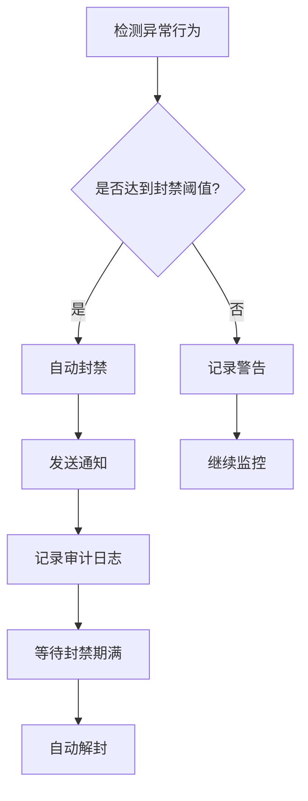
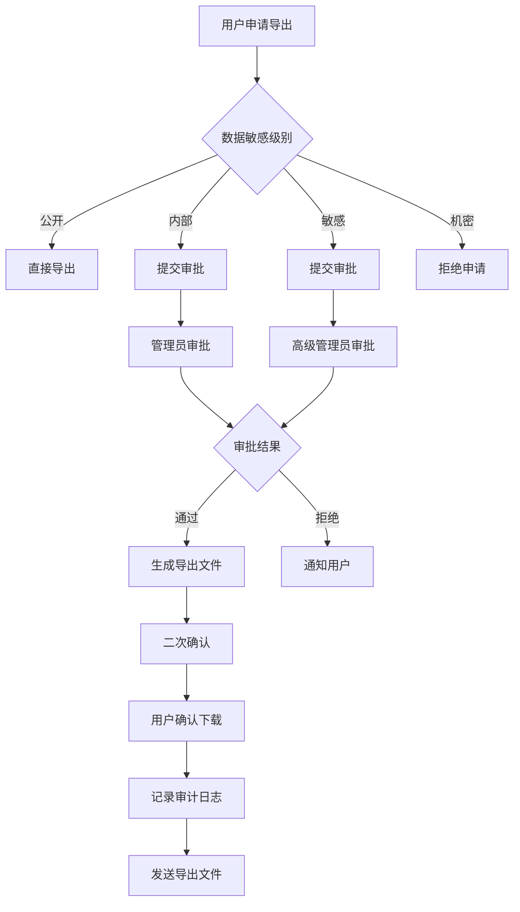
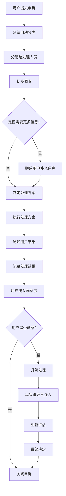

# 政策与风控清单

## 概述

本文档定义了儿童编程平台的滥用预防和风险控制策略，包括搜索限流、导出限制、申诉流程等关键安全措施。

## 搜索限流策略

### 账号级别限流

#### 搜索频率限制

| 用户类型   | 限制规则   | 时间窗口 | 超出限制处理   |
| ---------- | ---------- | -------- | -------------- |
| **学生**   | 10次/分钟  | 1分钟    | 临时限制5分钟  |
| **家长**   | 20次/分钟  | 1分钟    | 临时限制10分钟 |
| **教师**   | 50次/分钟  | 1分钟    | 临时限制15分钟 |
| **管理员** | 100次/分钟 | 1分钟    | 临时限制30分钟 |

#### 搜索内容限制

- **关键词过滤**: 过滤敏感、不当关键词
- **结果数量限制**: 单次搜索最多返回50个结果
- **搜索历史**: 保留最近100次搜索记录
- **异常检测**: 检测批量搜索、爬虫行为

#### 限流实现

```typescript
interface RateLimitConfig {
  windowMs: number; // 时间窗口（毫秒）
  maxRequests: number; // 最大请求数
  blockDurationMs: number; // 封禁时长（毫秒）
  skipSuccessfulRequests: boolean; // 是否跳过成功请求
}

const searchRateLimits: Record<UserRole, RateLimitConfig> = {
  student: {
    windowMs: 60 * 1000, // 1分钟
    maxRequests: 10,
    blockDurationMs: 5 * 60 * 1000, // 5分钟
    skipSuccessfulRequests: false,
  },
  parent: {
    windowMs: 60 * 1000, // 1分钟
    maxRequests: 20,
    blockDurationMs: 10 * 60 * 1000, // 10分钟
    skipSuccessfulRequests: false,
  },
  teacher: {
    windowMs: 60 * 1000, // 1分钟
    maxRequests: 50,
    blockDurationMs: 15 * 60 * 1000, // 15分钟
    skipSuccessfulRequests: false,
  },
  admin: {
    windowMs: 60 * 1000, // 1分钟
    maxRequests: 100,
    blockDurationMs: 30 * 60 * 1000, // 30分钟
    skipSuccessfulRequests: false,
  },
};
```

### IP级别限流

#### IP限流规则

| 限制类型     | 限制值     | 时间窗口 | 处理方式     |
| ------------ | ---------- | -------- | ------------ |
| **单IP请求** | 100次/分钟 | 1分钟    | 临时封禁IP   |
| **单IP搜索** | 50次/分钟  | 1分钟    | 临时封禁搜索 |
| **单IP并发** | 10个连接   | 实时     | 拒绝新连接   |

#### IP封禁策略

```typescript
interface IPBlockConfig {
  // 自动封禁条件
  autoBlock: {
    requestRate: number; // 请求频率阈值
    searchRate: number; // 搜索频率阈值
    errorRate: number; // 错误率阈值
    duration: number; // 封禁时长（小时）
  };

  // 手动封禁
  manualBlock: {
    reason: string; // 封禁原因
    duration: number; // 封禁时长
    adminId: string; // 操作管理员
  };

  // 白名单
  whitelist: string[]; // 白名单IP列表
}
```

### 封禁策略

#### 自动封禁条件

1. **高频请求**: 超过限制频率的2倍
2. **异常模式**: 检测到爬虫或自动化行为
3. **错误率过高**: 错误请求超过50%
4. **恶意搜索**: 包含敏感关键词的搜索

#### 封禁处理流程



---

## 导出限制策略

### 敏感数据识别

#### 数据分类

| 数据级别 | 数据类型               | 导出限制 |
| -------- | ---------------------- | -------- |
| **公开** | 课程信息、公开统计     | 无限制   |
| **内部** | 用户统计、系统指标     | 需要审批 |
| **敏感** | 学生个人信息、学习数据 | 严格限制 |
| **机密** | 密码、令牌、审计日志   | 禁止导出 |

#### 敏感数据清单

```typescript
const sensitiveDataFields = [
  // 个人信息
  'email',
  'phone',
  'realName',
  'idCard',

  // 学习数据
  'learningProgress',
  'testResults',
  'behaviorData',

  // 系统数据
  'passwordHash',
  'sessionToken',
  'apiKey',

  // 审计数据
  'auditLogs',
  'accessLogs',
  'errorLogs',
];
```

### 导出审批流程

#### 审批权限矩阵

| 用户角色       | 公开数据 | 内部数据 | 敏感数据 | 机密数据 |
| -------------- | -------- | -------- | -------- | -------- |
| **学生**       | ✅ 自助  | ❌ 禁止  | ❌ 禁止  | ❌ 禁止  |
| **家长**       | ✅ 自助  | ❌ 禁止  | ❌ 禁止  | ❌ 禁止  |
| **教师**       | ✅ 自助  | ✅ 申请  | ❌ 禁止  | ❌ 禁止  |
| **管理员**     | ✅ 自助  | ✅ 审批  | ✅ 审批  | ❌ 禁止  |
| **超级管理员** | ✅ 自助  | ✅ 审批  | ✅ 审批  | ✅ 审批  |

#### 导出申请流程



### 二次确认机制

#### 确认要求

1. **身份验证**: 重新输入密码或验证码
2. **用途说明**: 详细说明数据使用目的
3. **时间限制**: 导出链接24小时内有效
4. **下载限制**: 最多下载3次

#### 确认流程

```typescript
interface ExportConfirmation {
  userId: string;
  dataType: string;
  purpose: string;
  downloadLimit: number;
  expiresAt: Date;
  confirmationToken: string;
  auditLogId: string;
}

const confirmExport = async (confirmation: ExportConfirmation) => {
  // 1. 验证用户身份
  await verifyUserIdentity(confirmation.userId);

  // 2. 检查下载限制
  await checkDownloadLimit(confirmation.confirmationToken);

  // 3. 生成下载链接
  const downloadUrl = await generateSecureDownloadUrl(confirmation);

  // 4. 记录审计日志
  await logExportActivity(confirmation);

  // 5. 发送通知
  await notifyExportReady(confirmation.userId, downloadUrl);

  return downloadUrl;
};
```

---

## 申诉与仲裁流程

### 申诉类型

#### 用户申诉

| 申诉类型     | 处理时限 | 处理人员 | 升级条件         |
| ------------ | -------- | -------- | ---------------- |
| **账号封禁** | 24小时   | 客服     | 超过24小时未处理 |
| **数据访问** | 48小时   | 管理员   | 超过48小时未处理 |
| **权限问题** | 72小时   | 管理员   | 超过72小时未处理 |
| **系统错误** | 12小时   | 技术团队 | 超过12小时未处理 |

#### 申诉处理流程



### 仲裁机制

#### 仲裁委员会

- **主席**: 技术总监
- **成员**: 产品经理、法务代表、用户代表
- **秘书**: 客服主管

#### 仲裁规则

1. **独立性**: 仲裁委员会独立于日常运营
2. **公正性**: 基于事实和规则进行仲裁
3. **透明性**: 仲裁过程和结果公开透明
4. **时效性**: 仲裁决定具有最终效力

#### 仲裁流程

```typescript
interface ArbitrationCase {
  id: string;
  appellantId: string;        // 申诉人ID
  caseType: string;          // 案件类型
  description: string;       // 案件描述
  evidence: string[];        // 证据材料
  status: 'pending' | 'in_progress' | 'resolved' | 'closed';
  assignedArbitrators: string[]; // 分配的仲裁员
  hearingDate?: Date;        // 听证日期
  decision?: string;         // 仲裁决定
  decisionDate?: Date;       // 决定日期
}

const arbitrationProcess = {
  // 1. 案件受理
  acceptCase: async (case: ArbitrationCase) => {
    await validateCase(case);
    await assignArbitrators(case);
    await scheduleHearing(case);
  },

  // 2. 听证程序
  conductHearing: async (caseId: string) => {
    const case = await getCase(caseId);
    await collectEvidence(case);
    await hearParties(case);
    await deliberate(case);
  },

  // 3. 仲裁决定
  makeDecision: async (caseId: string, decision: string) => {
    await recordDecision(caseId, decision);
    await notifyParties(caseId, decision);
    await implementDecision(caseId, decision);
  }
};
```

### 管理员权限限制

#### 权限分级

| 权限级别          | 权限范围           | 审批要求 |
| ----------------- | ------------------ | -------- |
| **L1-客服**       | 基础用户服务       | 无需审批 |
| **L2-管理员**     | 用户管理、数据查看 | 需要审批 |
| **L3-高级管理员** | 系统配置、数据导出 | 需要审批 |
| **L4-超级管理员** | 所有权限           | 需要审批 |

#### 越权防护

```typescript
interface PermissionGuard {
  // 权限检查
  checkPermission: (userId: string, action: string, resource: string) => Promise<boolean>;

  // 权限审批
  requireApproval: (userId: string, action: string, resource: string) => Promise<boolean>;

  // 审计日志
  logPermissionUse: (
    userId: string,
    action: string,
    resource: string,
    result: boolean,
  ) => Promise<void>;

  // 权限变更
  changePermission: (
    targetUserId: string,
    newPermissions: string[],
    operatorId: string,
  ) => Promise<void>;
}

const permissionGuard: PermissionGuard = {
  checkPermission: async (userId, action, resource) => {
    const user = await getUser(userId);
    const hasPermission = await checkUserPermission(user, action, resource);

    // 记录权限检查
    await logPermissionCheck(userId, action, resource, hasPermission);

    return hasPermission;
  },

  requireApproval: async (userId, action, resource) => {
    const requiresApproval = await checkApprovalRequirement(action, resource);
    if (requiresApproval) {
      await createApprovalRequest(userId, action, resource);
      return false; // 需要审批
    }
    return true; // 无需审批
  },
};
```

---

## 风险控制措施

### 实时监控

#### 异常行为检测

```typescript
interface AnomalyDetection {
  // 检测异常登录
  detectAbnormalLogin: (userId: string, loginInfo: LoginInfo) => Promise<boolean>;

  // 检测异常搜索
  detectAbnormalSearch: (userId: string, searchQuery: string) => Promise<boolean>;

  // 检测异常导出
  detectAbnormalExport: (userId: string, exportRequest: ExportRequest) => Promise<boolean>;

  // 检测异常访问
  detectAbnormalAccess: (userId: string, accessLog: AccessLog) => Promise<boolean>;
}

const anomalyDetection: AnomalyDetection = {
  detectAbnormalLogin: async (userId, loginInfo) => {
    const userHistory = await getUserLoginHistory(userId);
    const isAbnormal = await analyzeLoginPattern(userHistory, loginInfo);

    if (isAbnormal) {
      await triggerSecurityAlert(userId, 'abnormal_login', loginInfo);
    }

    return isAbnormal;
  },

  detectAbnormalSearch: async (userId, searchQuery) => {
    const searchHistory = await getUserSearchHistory(userId);
    const isAbnormal = await analyzeSearchPattern(searchHistory, searchQuery);

    if (isAbnormal) {
      await triggerSecurityAlert(userId, 'abnormal_search', { query: searchQuery });
    }

    return isAbnormal;
  },
};
```

#### 风险评分

```typescript
interface RiskScore {
  userId: string;
  score: number; // 0-100分
  factors: RiskFactor[]; // 风险因子
  level: 'low' | 'medium' | 'high' | 'critical';
  lastUpdated: Date;
}

interface RiskFactor {
  type: string; // 风险类型
  weight: number; // 权重
  value: number; // 风险值
  description: string; // 描述
}

const calculateRiskScore = async (userId: string): Promise<RiskScore> => {
  const factors: RiskFactor[] = [];

  // 登录异常
  const loginAnomaly = await getLoginAnomalyScore(userId);
  factors.push({
    type: 'login_anomaly',
    weight: 0.3,
    value: loginAnomaly,
    description: '登录行为异常',
  });

  // 搜索异常
  const searchAnomaly = await getSearchAnomalyScore(userId);
  factors.push({
    type: 'search_anomaly',
    weight: 0.2,
    value: searchAnomaly,
    description: '搜索行为异常',
  });

  // 访问异常
  const accessAnomaly = await getAccessAnomalyScore(userId);
  factors.push({
    type: 'access_anomaly',
    weight: 0.2,
    value: accessAnomaly,
    description: '访问行为异常',
  });

  // 导出异常
  const exportAnomaly = await getExportAnomalyScore(userId);
  factors.push({
    type: 'export_anomaly',
    weight: 0.3,
    value: exportAnomaly,
    description: '导出行为异常',
  });

  // 计算总分
  const totalScore = factors.reduce((sum, factor) => sum + factor.value * factor.weight, 0);

  // 确定风险等级
  let level: 'low' | 'medium' | 'high' | 'critical';
  if (totalScore < 30) level = 'low';
  else if (totalScore < 60) level = 'medium';
  else if (totalScore < 80) level = 'high';
  else level = 'critical';

  return {
    userId,
    score: totalScore,
    factors,
    level,
    lastUpdated: new Date(),
  };
};
```

### 自动响应

#### 响应策略

| 风险等级     | 自动响应 | 人工介入     |
| ------------ | -------- | ------------ |
| **低风险**   | 记录日志 | 无需介入     |
| **中风险**   | 增加监控 | 24小时内审查 |
| **高风险**   | 限制功能 | 12小时内审查 |
| **极高风险** | 临时封禁 | 立即审查     |

#### 响应实现

```typescript
const riskResponse = {
  // 低风险响应
  lowRisk: async (userId: string, riskScore: RiskScore) => {
    await logRiskEvent(userId, riskScore);
    await increaseMonitoring(userId);
  },

  // 中风险响应
  mediumRisk: async (userId: string, riskScore: RiskScore) => {
    await logRiskEvent(userId, riskScore);
    await increaseMonitoring(userId);
    await createReviewTask(userId, 'medium_risk_review', 24);
  },

  // 高风险响应
  highRisk: async (userId: string, riskScore: RiskScore) => {
    await logRiskEvent(userId, riskScore);
    await restrictUserFunctions(userId, ['export', 'bulk_operations']);
    await createReviewTask(userId, 'high_risk_review', 12);
  },

  // 极高风险响应
  criticalRisk: async (userId: string, riskScore: RiskScore) => {
    await logRiskEvent(userId, riskScore);
    await temporarilySuspendUser(userId);
    await createUrgentReviewTask(userId, 'critical_risk_review', 0);
    await notifySecurityTeam(userId, riskScore);
  },
};
```

---

## 合规检查

### CI/CD集成

#### 政策文件检查

```yaml
# .github/workflows/policy-check.yml
name: Policy Compliance Check

on:
  push:
    branches: [main, develop]
  pull_request:
    branches: [main]

jobs:
  policy-check:
    runs-on: ubuntu-latest
    steps:
      - uses: actions/checkout@v3

      - name: Check Policy Files
        run: |
          # 检查政策文件是否存在
          test -f docs/policy/abuse-mitigation.md || exit 1
          test -f docs/policy/safety-baseline.md || exit 1
          test -f docs/ops/logging.md || exit 1
          test -f docs/ops/metrics.md || exit 1

          # 检查政策文件内容
          grep -q "搜索限流" docs/policy/abuse-mitigation.md || exit 1
          grep -q "导出限制" docs/policy/abuse-mitigation.md || exit 1
          grep -q "申诉流程" docs/policy/abuse-mitigation.md || exit 1

          echo "✅ All policy files are present and contain required content"

      - name: Check Security Headers
        run: |
          # 检查安全头配置
          grep -q "X-Content-Type-Options" packages/api/src/main.ts || exit 1
          grep -q "X-Frame-Options" packages/api/src/main.ts || exit 1
          grep -q "X-XSS-Protection" packages/api/src/main.ts || exit 1

          echo "✅ Security headers are configured"

      - name: Check Rate Limiting
        run: |
          # 检查限流配置
          grep -q "rate.*limit" server/executor/src/main.ts || exit 1
          grep -q "RateLimitService" packages/api/src/modules/relationships/relationships.module.ts || exit 1

          echo "✅ Rate limiting is implemented"
```

#### 自动化测试

```typescript
// tests/policy-compliance.test.ts
describe('Policy Compliance', () => {
  test('should have rate limiting configured', async () => {
    const response = await request(app)
      .get('/api/students/search')
      .set('X-User-Id', 'test-user')
      .expect(200);

    // 检查响应头是否包含限流信息
    expect(response.headers['x-ratelimit-limit']).toBeDefined();
    expect(response.headers['x-ratelimit-remaining']).toBeDefined();
  });

  test('should block excessive requests', async () => {
    const promises = Array(20)
      .fill(0)
      .map(() => request(app).get('/api/students/search').set('X-User-Id', 'test-user'));

    const responses = await Promise.all(promises);
    const blockedResponses = responses.filter((r) => r.status === 429);

    expect(blockedResponses.length).toBeGreaterThan(0);
  });

  test('should require approval for sensitive data export', async () => {
    const response = await request(app)
      .post('/api/data/export')
      .set('X-User-Id', 'test-user')
      .send({
        dataType: 'sensitive',
        fields: ['email', 'phone'],
      })
      .expect(403);

    expect(response.body.error).toContain('approval required');
  });
});
```

---

## 审计与报告

### 审计日志

#### 关键事件记录

```typescript
interface AuditEvent {
  id: string;
  timestamp: Date;
  userId: string;
  action: string;
  resource: string;
  result: 'success' | 'failure' | 'blocked';
  ipAddress: string;
  userAgent: string;
  metadata: Record<string, any>;
}

const auditEvents = [
  'user_login',
  'user_logout',
  'search_performed',
  'data_exported',
  'permission_granted',
  'permission_revoked',
  'account_suspended',
  'account_unsuspended',
  'rate_limit_exceeded',
  'anomaly_detected',
];
```

#### 审计报告

```typescript
const generateAuditReport = async (startDate: Date, endDate: Date) => {
  const events = await getAuditEvents(startDate, endDate);

  const report = {
    period: { startDate, endDate },
    summary: {
      totalEvents: events.length,
      uniqueUsers: new Set(events.map((e) => e.userId)).size,
      successRate: events.filter((e) => e.result === 'success').length / events.length,
      blockedEvents: events.filter((e) => e.result === 'blocked').length,
    },
    topActions: getTopActions(events),
    topUsers: getTopUsers(events),
    securityEvents: getSecurityEvents(events),
    recommendations: generateRecommendations(events),
  };

  return report;
};
```

### 合规报告

#### 月度合规报告

```markdown
# 月度合规报告 - 2024年1月

## 执行摘要

- 总用户数: 1,250
- 活跃用户数: 890
- 安全事件数: 12
- 申诉处理数: 8
- 合规率: 99.2%

## 关键指标

- 搜索限流触发次数: 45
- 导出审批通过率: 85%
- 申诉处理及时率: 95%
- 风险用户识别数: 3

## 安全事件

1. 异常登录检测: 5次
2. 批量搜索行为: 3次
3. 权限越权尝试: 2次
4. 数据导出异常: 2次

## 改进建议

1. 加强用户教育，减少误操作
2. 优化限流算法，减少误判
3. 完善申诉流程，提高处理效率
```

---

**文档版本**: v1.0  
**最后更新**: 2024-01-03  
**维护人员**: 安全团队  
**审核状态**: 待审核
