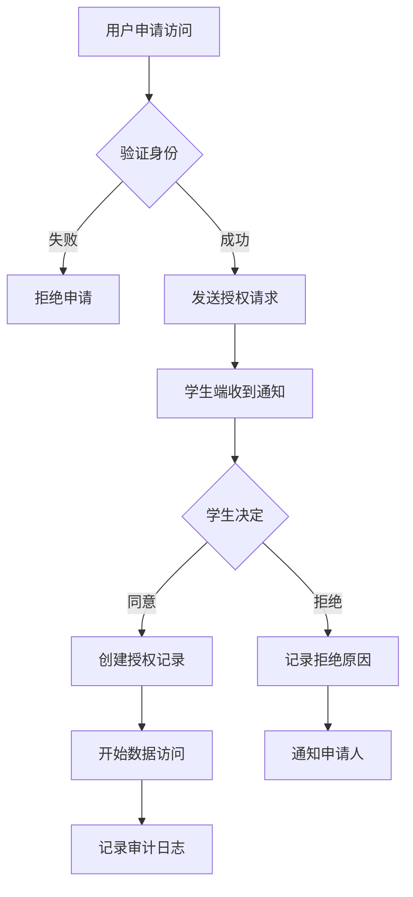

# 安全基线政策 (Safety Baseline Policy)

## 概述

本文档定义了儿童编程平台的数据安全和隐私保护基线要求，确保所有功能都符合最小可见性、授权到期、默认私有、撤销与审计的核心原则。

## 核心原则

### 1. 最小可见性 (Minimal Visibility)

**原则**: 用户只能访问其明确授权范围内的数据。

**实施要求**:
- 所有数据访问必须通过权限检查
- 默认拒绝所有未明确授权的访问
- 权限范围必须明确定义和限制
- 定期审查和清理过期的访问权限

**技术实现**:
```typescript
// 示例：权限检查
const hasAccess = await checkAccessPermission(userId, resourceId, scope);
if (!hasAccess) {
  throw new ForbiddenException('无权限访问此资源');
}
```

### 2. 授权到期 (Authorization Expiration)

**原则**: 所有授权都必须有明确的过期时间。

**实施要求**:
- 所有访问授权必须设置过期时间
- 支持不同时长的授权（1周、1月、3月、1年、永久）
- 过期前7天发送提醒通知
- 过期后自动撤销访问权限
- 提供授权续期机制

**技术实现**:
```typescript
// 示例：授权过期检查
const isExpired = grant.expiresAt && new Date() > grant.expiresAt;
if (isExpired) {
  await revokeAccessGrant(grantId);
}
```

### 3. 默认私有 (Default Private)

**原则**: 所有学生数据默认仅学生本人可见。

**实施要求**:
- 新创建的学生数据默认为私有状态
- 家长/教师必须通过明确授权才能访问
- 系统管理员无法绕过授权机制
- 数据导出需要额外授权

**技术实现**:
```typescript
// 示例：默认私有设置
const studentData = {
  ...data,
  visibility: 'private', // 默认私有
  authorizedUsers: [], // 空数组，需要明确授权
};
```

### 4. 撤销与审计 (Revocation & Audit)

**原则**: 所有授权都可以被撤销，所有操作都有审计记录。

**实施要求**:
- 学生可以随时撤销任何授权
- 家长/教师可以撤销自己的访问权限
- 所有数据访问都记录在审计日志中
- 审计日志不可篡改，保留至少2年
- 提供审计日志查询和导出功能

**技术实现**:
```typescript
// 示例：审计日志记录
await auditService.log({
  actorId: userId,
  action: 'view_student_data',
  targetType: 'student',
  targetId: studentId,
  metadata: { dataType: 'progress', scope: 'read' }
});
```

## 数据分类与保护级别

### 高敏感数据 (High Sensitivity)
- 学生个人信息（姓名、邮箱、头像）
- 学习进度和成绩
- 编程作品和代码
- 学习行为数据

**保护要求**:
- 必须加密存储
- 访问需要明确授权
- 所有访问都有审计记录
- 支持数据删除和匿名化

### 中敏感数据 (Medium Sensitivity)
- 班级信息
- 课程内容
- 学习统计（聚合数据）

**保护要求**:
- 访问需要角色授权
- 记录访问日志
- 支持数据导出

### 低敏感数据 (Low Sensitivity)
- 系统配置
- 公开课程信息
- 匿名统计数据

**保护要求**:
- 基本访问控制
- 记录重要操作

## 授权管理

### 授权类型

1. **家长授权**
   - 申请方式：输入学生邮箱
   - 授权范围：学习进度、作品查看
   - 有效期：1周-1年
   - 撤销方式：学生端或家长端

2. **教师授权**
   - 申请方式：班级邀请码
   - 授权范围：班级内学生数据
   - 有效期：跟随班级生命周期
   - 撤销方式：退出班级或教师撤销

3. **管理员授权**
   - 申请方式：系统配置
   - 授权范围：系统管理功能
   - 有效期：永久（可撤销）
   - 撤销方式：角色变更

### 授权流程



## 审计要求

### 审计事件类型

1. **数据访问事件**
   - 查看学生数据
   - 导出数据
   - 修改数据

2. **授权管理事件**
   - 创建授权
   - 修改授权
   - 撤销授权
   - 授权过期

3. **系统管理事件**
   - 用户登录
   - 角色变更
   - 系统配置修改

### 审计日志格式

```typescript
interface AuditLog {
  id: string;
  actorId: string;        // 操作者ID
  action: string;         // 操作类型
  targetType: string;     // 目标类型
  targetId: string;       // 目标ID
  metadata: Record<string, any>; // 额外信息
  timestamp: Date;        // 操作时间
  ipAddress?: string;     // IP地址
  userAgent?: string;     // 用户代理
}
```

## 合规要求

### 数据保护法规

1. **GDPR (欧盟通用数据保护条例)**
   - 数据最小化原则
   - 用户同意机制
   - 数据可携带权
   - 被遗忘权

2. **COPPA (美国儿童在线隐私保护法)**
   - 13岁以下儿童特殊保护
   - 家长同意要求
   - 数据收集限制

3. **中国个人信息保护法**
   - 个人信息分类保护
   - 同意机制
   - 数据本地化要求

### 技术合规措施

1. **数据加密**
   - 传输加密：TLS 1.3
   - 存储加密：AES-256
   - 密钥管理：HSM或密钥管理服务

2. **访问控制**
   - 多因素认证
   - 角色基础访问控制
   - 最小权限原则

3. **数据备份与恢复**
   - 定期备份
   - 异地存储
   - 恢复测试

## 违规处理

### 违规类型

1. **轻微违规**
   - 未授权访问尝试
   - 权限使用不当
   - 审计日志缺失

2. **严重违规**
   - 绕过授权机制
   - 数据泄露
   - 审计日志篡改

3. **重大违规**
   - 恶意数据访问
   - 大规模数据泄露
   - 系统安全漏洞

### 处理措施

1. **立即响应**
   - 暂停相关账户
   - 撤销可疑授权
   - 记录事件详情

2. **调查分析**
   - 分析影响范围
   - 确定违规原因
   - 评估损失程度

3. **修复改进**
   - 修复安全漏洞
   - 加强防护措施
   - 更新安全策略

## 定期审查

### 审查频率

- **月度审查**: 权限使用情况
- **季度审查**: 安全策略有效性
- **年度审查**: 整体安全架构

### 审查内容

1. **权限审计**
   - 检查未使用的权限
   - 验证权限分配合理性
   - 清理过期授权

2. **访问模式分析**
   - 识别异常访问
   - 分析访问趋势
   - 优化权限模型

3. **合规性检查**
   - 验证法规遵循情况
   - 检查技术措施有效性
   - 更新合规要求

## 培训与意识

### 用户培训

1. **学生培训**
   - 隐私保护意识
   - 授权管理方法
   - 安全使用指南

2. **家长培训**
   - 数据访问权限
   - 授权管理流程
   - 隐私保护责任

3. **教师培训**
   - 班级管理权限
   - 学生数据保护
   - 安全教学实践

### 开发团队培训

1. **安全开发**
   - 安全编码规范
   - 隐私保护设计
   - 漏洞防护方法

2. **运维安全**
   - 系统安全配置
   - 监控告警机制
   - 应急响应流程

## 更新与维护

### 文档更新

- 每季度审查政策文档
- 根据法规变化更新要求
- 记录所有变更历史

### 技术更新

- 定期更新安全技术
- 升级防护措施
- 测试安全机制有效性

---

**文档版本**: v1.0  
**最后更新**: 2024-01-02  
**下次审查**: 2024-04-02  
**负责人**: 安全团队